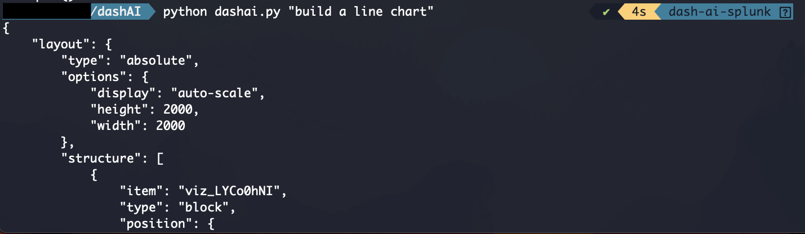

# Splunk Dashboard Studio WireframeGenerator

Splunk Dashboard Studio helper using chatgpt. There is the ocasional time where is necesary to quickly generate a dashboard wireframe to be filled with the required information and format. By "feeding" chatgpt a basic JSON schema it will be able to generate on top of that as per users request. 

&nbsp;
## Requirements. 

1. Get your API key [openai](https://platform.openai.com/docs/api-reference)

2. Check the Splunk Dashboard Studio Documentation for the JSON schema [here](https://docs.splunk.com/Documentation/SplunkCloud/9.0.2303/DashStudio/dashDef).

3. You may want you to request a test/dev license from Splunk in order to test this.

4. Python Libraries:

| Package | 
| -------------- | 
| json |  |
| argparse | 
| openai | 
| os | 

Openai python library: https://github.com/openai/openai-python


## How to setup? 

### 1. Set your API key as a env variable this will vary on your OS:


#### Linux / MacOS 

1.1 Type the following command to set the env variable `OPENAI_API_KEY`.

```bash 
export OPENAI_API_KEY="your-API-key-here"
```

To make this change persistent, add the command to your shell's config either `~/.bash_profile` or `~/.zshrc`. 


### 2. Run the `dashai_setup.sh`

``` bash 
source dashai_setup.sh
```

&nbsp;
## Examples: 

For further details visit: https://youtu.be/XyEnesetDF8

1. Run the script as follows

```bash
python dashai.py "<your promt here>"

```

It will generate the output directly in the terminal


2. Build a Line Chart

```bash
python dashai.py "build a line chart"
```



Output example:

``` json
{
    "layout": {
        "type": "absolute",
        "options": {
            "display": "auto-scale",
            "height": 2000,
            "width": 2000
        },
        "structure": [
            {
                "item": "viz_LYCo0hNI",
                "type": "block",
                "position": {
                    "x": 20,
                    "y": 20,
                    "w": 300,
                    "h": 300
                }
            }
        ],
        "globalInputs": [
            "input_global_trp"
        ]
    },
    "visualizations": {
        "viz_LYCo0hNI": {
            "type": "splunk.line",
            "title": "line chart"
        }
    },
    "dataSources": {},
    "defaults": {
        "dataSources": {
            "ds.search": {
                "options": {
                    "queryParameters": {
                        "latest": "$global_time.latest$",
                        "earliest": "$global_time.earliest$"
                    }
                }
            }
        }
    },
    "inputs": {
        "input_global_trp": {
            "type": "input.timerange",
            "options": {
                "token": "global_time",
                "defaultValue": "-24h@h,now"
            },
            "title": "Global Time Range"
        }
    },
    "description": "",
    "title": "mydashboard"
    }

```


3. It is recommended to send the output of the command to a txt. 

```bash
python dashai.py "build a line chart" > exampledashboard.txt

```


